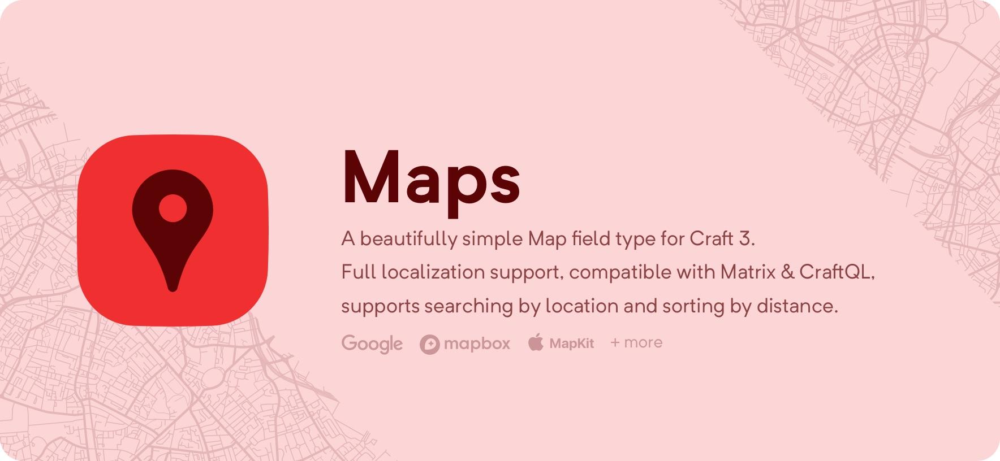
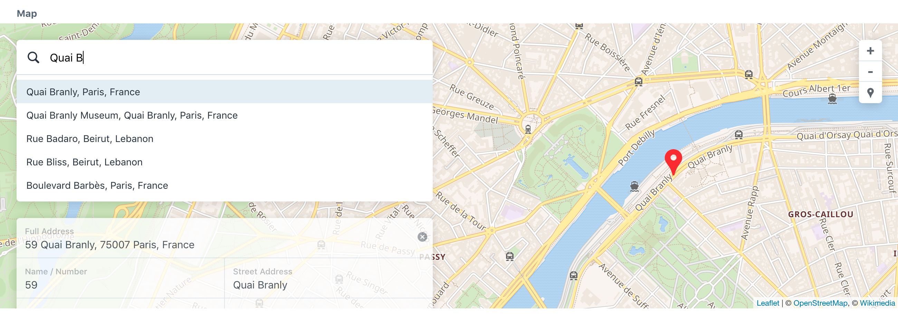
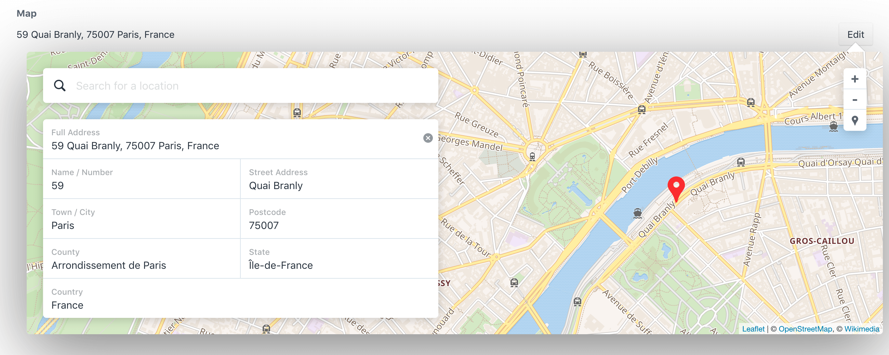
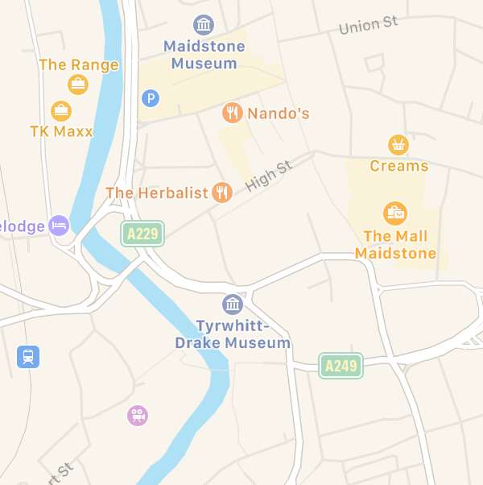
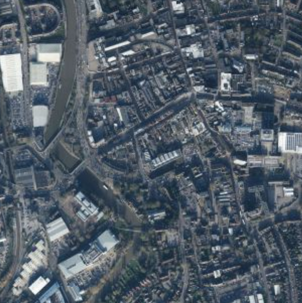
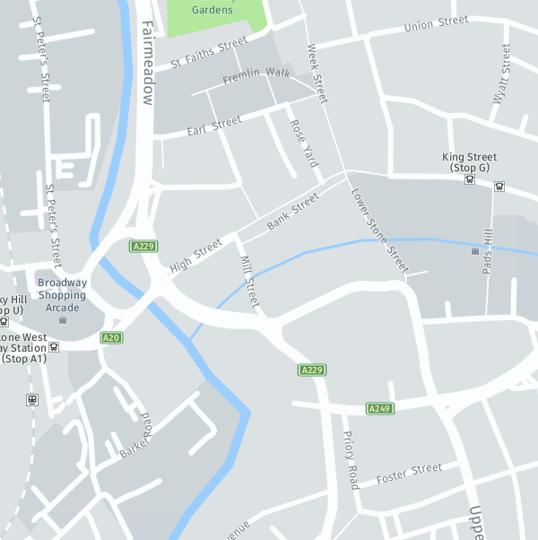
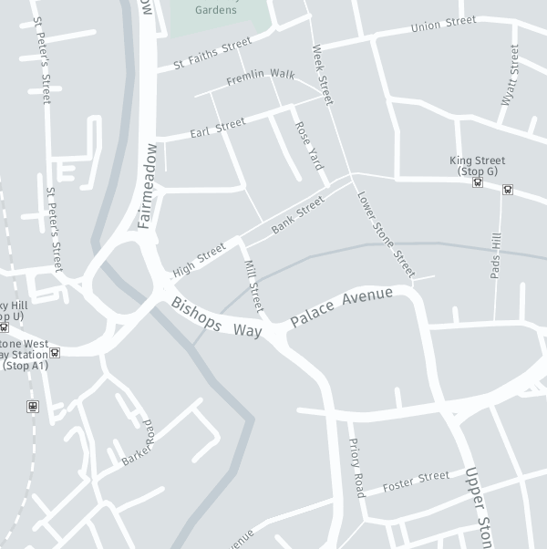
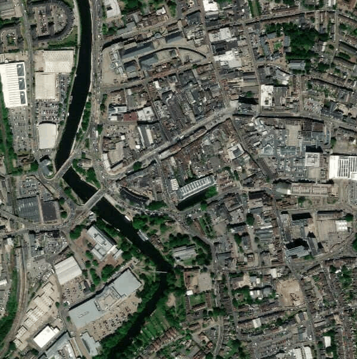
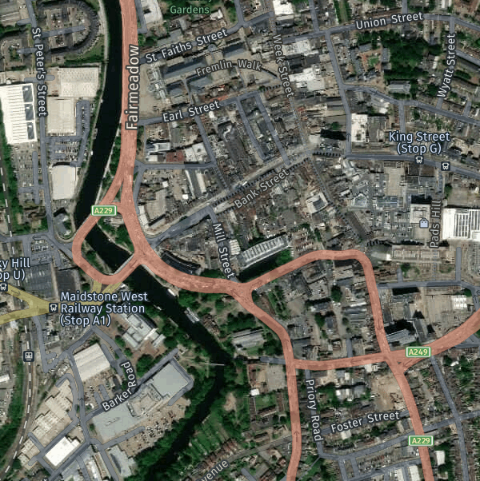

# Maps

A beautifully simple, yet deceptively powerful, Map field that works out of the 
box with no setup or API tokens needed! 

Configure the map field to only show the features you want; hide the address, 
show latitude / longitude, or hide the map entirely. Choose from 4 geocoding 
services, 3 geolocation services, and 24 map tilesets!

Maps offers full mutli-site support, compatibility with Matrix, 
[SuperTable](https://verbb.io/craft-plugins/super-table/features), and 
[CraftQL](https://plugins.craftcms.com/craftql), and the ability to search by 
location and sort by distance.

## Mini Map

Maps offers a mini map field that fits perfectly in a Super Table without 
taking up a lot of space!

## Map Tiles and Geo

Maps supports the following map tiles:

  
Wikimedia

  [Wikimedia](https://foundation.wikimedia.org/wiki/Maps_Terms_of_Use) | | | 
  --- | --- | ---  
   |  | 
  Wikimedia | | 

  
OpenStreetMap

  
  [OpenStreetMap](https://www.openstreetmap.org) | | | 
  --- | --- | ---
   |  | 
  OpenStreetMap | | 

  
Carto (Voyager, Positron, Dark Matter)

 
  [Carto](https://carto.com/location-data-services/basemaps/) | | | 
  --- | --- | ---
   |  | 
  Voyager | Positron | Dark Matter

  
Mapbox (Outdoors, Streets, Dark, Light)

  [Mapbox](https://www.mapbox.com) | | | 
  --- | --- | ---  
   |  | 
  Outdoors | Streets | Dark
   | |
  Light | |

  
Google Maps (Roadmap, Terrain, Hybrid)

  [Google Maps](https://www.google.com/maps) | | | 
  --- | --- | ---  
   |  | 
  Roadmap | Terrain | Hybrid

  
Apple MapKit (Standard, Muted, Satellite, Hybrid)

  [Apple MapKit](https://developer.apple.com/maps/mapkitjs/) | | | 
  --- | --- | ---  
   |  | 
  Standard | Muted | Satellite
   | |
  Hybrid | |  

  
Here (Day, Day Grey, Day Transit, Reduced, Pedestrian, Terrain, Satellite, Hybrid)

  
  [Here](https://www.here.com/) | | | 
  --- | --- | ---
   |  | 
  Day | Day Grey | Day Transit
   |  | 
  Reduced | Pedestrian | Terrain
   |  |
  Satellite | Hybrid |

  
And these geocoding services:

- [Nominatim (OpenStreetMap)](https://nominatim.openstreetmap.org/)
- [Mapbox](https://www.mapbox.com/)
- [Google Maps](https://www.google.com/maps)
- [Here](https://www.here.com/)

And these geolocation services:
- [ipstack](https://ipstack.com/)
- [MaxMind Lite](https://dev.maxmind.com/geoip/geoip2/geolite2/)
- [MaxMind](https://maxmind.com/)

## Documentation
For full documentation visit the 
**[Maps Ether Docs](https://docs.ethercreative.co.uk/maps)**.
