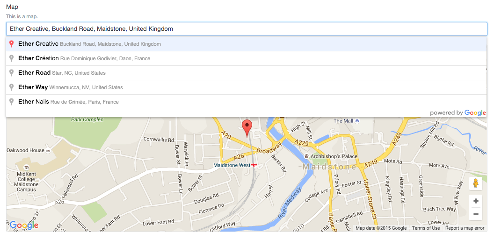

# Simple Map
A beautifully simple Google Map field type for Craft CMS, compatible with Matrix.

## Installation
Clone this repo into `craft/plugins/simplemap`.

## Usage
Create the field as you would any other.  
The field type will return an array containing `lat`, `lng`, `zoom`, and `address`. This means you can use `{{ myMapField.lat }}`.

## Changelog

### 1.1.0
- Merged \#2 & \#3 from @cballenar
- \#2 - Field now stores map zoom
- \#3 - Improved handling of unknown locations
- Improved error message display

### 1.0.2
- Added link to docs
- Added releases json for updates

### 1.0.1
- Fixed: Hidden Lat/Lng/Address fields are now cleared when the Address Search input is empty.

### 1.0.0
- Initial Release

---
  
Copyright © 2015 Ether Creative <hello@ethercreative.co.uk>

Permission is hereby granted, free of charge, to any person obtaining a copy of this software and associated documentation files (the “Software”), to deal in the Software without restriction, including without limitation the rights to use, copy, modify, merge, publish, distribute, sublicense, and/or sell copies of the Software, and to permit persons to whom the Software is furnished to do so, subject to the following conditions:

The above copyright notice and this permission notice shall be included in all copies or substantial portions of the Software.

THE SOFTWARE IS PROVIDED “AS IS”, WITHOUT WARRANTY OF ANY KIND, EXPRESS OR IMPLIED, INCLUDING BUT NOT LIMITED TO THE WARRANTIES OF MERCHANTABILITY, FITNESS FOR A PARTICULAR PURPOSE AND NONINFRINGEMENT. IN NO EVENT SHALL THE AUTHORS OR COPYRIGHT HOLDERS BE LIABLE FOR ANY CLAIM, DAMAGES OR OTHER LIABILITY, WHETHER IN AN ACTION OF CONTRACT, TORT OR OTHERWISE, ARISING FROM, OUT OF OR IN CONNECTION WITH THE SOFTWARE OR THE USE OR OTHER DEALINGS IN THE SOFTWARE.