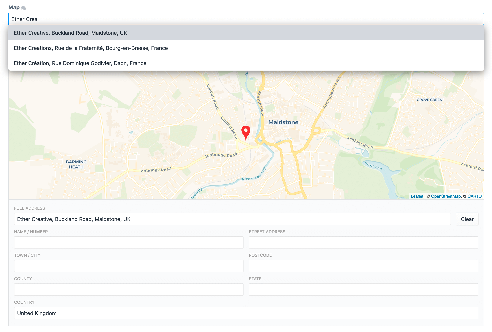

# Maps
A beautifully simple map field type for Craft CMS 3.

Maps offers full mutli-site support, compatibility with Matrix and 
[CraftQL](https://plugins.craftcms.com/craftql), and the ability to search by 
location and sort by distance.

The field type supports 24 different map tiles and 4 different geo-location 
services.



## Usage
Create the field as you would any other.  
The field type will return an array containing the following:

 - `lat` - The selected locations latitude
 - `lng` - The selected locations longitude
 - `zoom` - The zoom level of the map
 - `address` - The address of the selected location
 - `parts` - See below
 - `distance` - The distance from the search location (in whatever unit you searched with). Will be empty if you aren't searching by location.

This means you can use `{{ myMapField.lat }}`.

**`parts`**

This contains the locations address, broken down into its constituent parts. 
These parts can be changed in the map field. They include:
- `number` - Location name / number
- `address` - The locations street address
- `city` - The city the location is in
- `postcode` - The locations postal code
- `county` - The county of the location
- `state` - The locations state
- `country` - The country of the location

If you're upgrading from an older version of Maps (SimpleMap) you will still 
have access to all the old parts from Google. 

### Configuration

You can configure the plugin either via the Craft CP or by duplicating the 
`config.php` file to `config/simplemap.php`.

### Searching and Sorting

You can search for elements using the location specified in your map field. When searching by your map field you also have the option to sort the results by distance.

```twig

```

- `location`: Can either be an address string (requires a Google Maps Geocoding API key) or a Lat Lng Array (`{ 'lat': 51.27219908, 'lng': 0.51545620 }`).
- `country`: *Optional*. Restrict the search to a specific country (useful for non-specific searches, i.e. town name). Must be valid [2-letter ISO code](https://en.wikipedia.org/wiki/ISO_3166-1#Current_codes) (recommended), or full country name.
- `radius`: *Optional*. The radius around the location to search. Defaults to `50`.
- `unit`: *Optional*. The unit of measurement for the search. Can be either `km` (kilometers) or `mi` (miles). Defaults to `km`.

### API Keys

You can access your front-end map token in templates using `craft.maps.mapToken`.

### Displaying a Map

This plugin does (currently) **not** generate a front-end map; how you do that and what map library you use is up to you. However, since we have received a lot of questions asking how to do so, here are a couple of examples.
  
Using [Google Maps](https://developers.google.com/maps/documentation/javascript/tutorial):

```twig
<div id="map" style="height: 400px;"></div>
<script>
  var map;
  function initMap() {
    // Display the map
    map = new google.maps.Map(document.getElementById("map"), {
      center: {
        lat: {{ entry.mapLocation.lat }},
        lng: {{ entry.mapLocation.lng }}
      },
      zoom: {{ entry.mapLocation.zoom }}
    });
    
    // Display the marker
    var marker = new google.maps.Marker({
      position: {
        lat: {{ entry.mapLocation.lat }},
        lng: {{ entry.mapLocation.lng }}
      },
      // A custom icon can be defined here, if desired
      // icon: '/path/to/custom/icon.png',
      map: map
    });
  }
</script>
<script src="https://maps.googleapis.com/maps/api/js?key={{ craft.simpleMap.apiKey }}&callback=initMap" async defer></script>
```

And [Mapbox](https://www.mapbox.com/mapbox-gl-js/api/):

```twig
<script src="https://api.mapbox.com/mapbox-gl-js/v0.43.0/mapbox-gl.js"></script>
<link href="https://api.mapbox.com/mapbox-gl-js/v0.43.0/mapbox-gl.css" rel="stylesheet" />

<div id="map" style="width: 400px; height: 300px;"></div>
<script>
mapboxgl.accessToken = "YOUR_API_KEY";
var map = new mapboxgl.Map({
  container: "map",
  style: "mapbox://styles/mapbox/streets-v9",
  center: [
    {{ entry.myMapField.lng }},
    {{ entry.myMapField.lat }}
  ]
});
</script>
```

### Converting an address to Lat/Lng
If you need to convert a string address to a Lat/Lng you can do so using the 
`craft.maps.getLatLngFromAddress($addressString[, $country])` variable.
An example of this would be wanting to convert a customers delivery address to a 
Lat/Lng, to display it on a map.

- `$address` - The string address you want to convert.
- `$country` - *Optional.* Restrict the conversion to a specific country (useful for non-specific searches, i.e. town name). Must be valid [2-letter ISO code](https://en.wikipedia.org/wiki/ISO_3166-1#Current_codes) (recommended), or full country name. 

```twig


{{ location.lat }}
{{ location.lng }}
```

## Roadmap

> Coming Soon™

- Output Static Maps
- Output Dynamic Maps
- Support env in settings