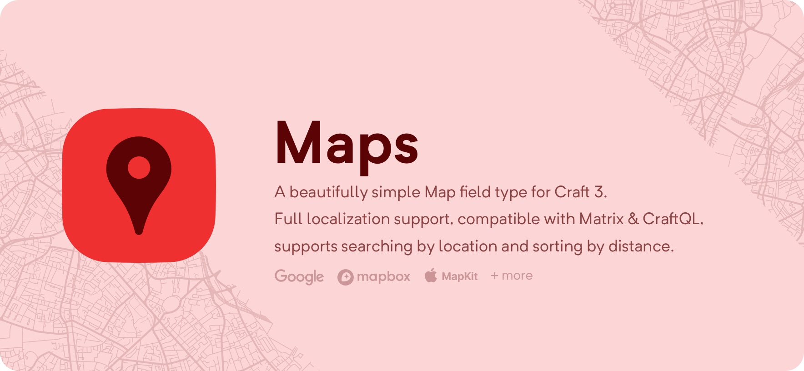

# Maps

A beautifully simple, yet deceptively powerful map field that works out of the 
box with no setup or API tokens needed!

Configure the map field to show only the features you want; display 
latitude/longitude, hide the address or even the entire map. Choose from 4 
geocoding services, 3 geolocation services, and 24 map tilesets!

'Maps' offers full multi-site support, compatibility with Matrix, 
[SuperTable](https://verbb.io/craft-plugins/super-table/features), 
[CraftQL](https://plugins.craftcms.com/craftql), and the ability to search by 
location and sort by distance.

**[View Maps on the Plugin Store](https://plugins.craftcms.com/simplemap)**

